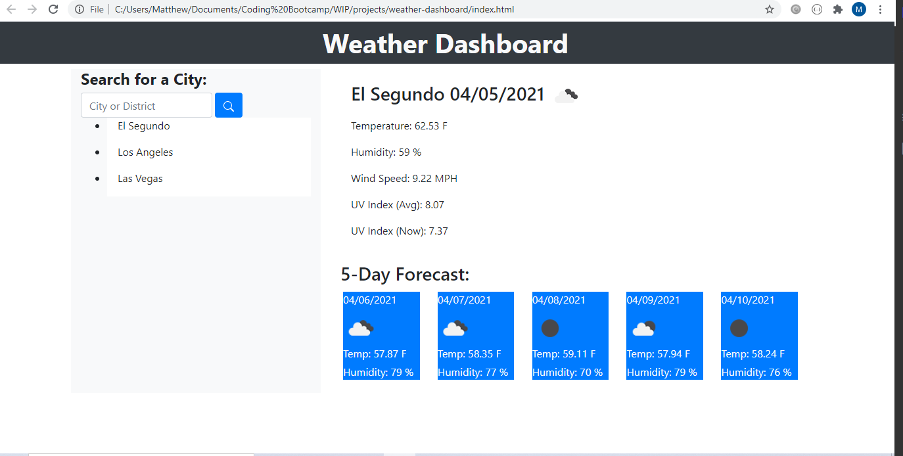

# Weather Dashboard

## Purpose
Build a weather dashboard that will run in the browser and feature dynamically updated HTML and CSS. Retrieve data from another application's API.

## Built With
* Javascript
* HTML
* CSS
* jQuery
* Bootstrap

## Website
https://mmanalang21.github.io/weather-dashboard/

## Contribution
Made by Matthew Manalang
